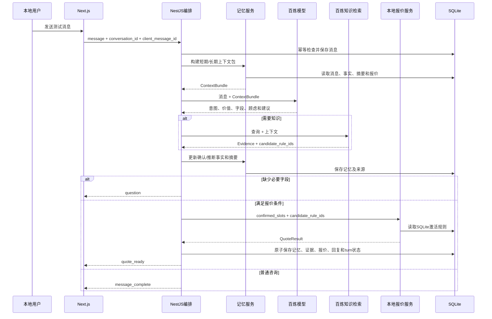

# 装修销售 AI｜本地 MVP 解决方案设计

## 1. 方案目标

在一台开发电脑上运行 Next.js、NestJS 和 SQLite，通过网络调用阿里云百炼模型与知识检索，验证意图、价值、知识、上下文、记忆和确定性报价的完整链路。

## 2. 总体架构

```text
localhost 浏览器
→ Next.js 聊天页
→ NestJS API / 会话编排
   ├→ 百炼模型：意图、价值、字段、顾虑、建议动作
   ├→ 百炼知识检索：企业与报价依据
   ├→ 记忆服务：短期窗口、长期事实与摘要
   ├→ 报价服务：读取 SQLite 激活规则并计算
   └→ SQLite：会话、记忆、证据、规则和报价
→ 返回文本或报价卡片
```

## 3. 技术组件边界

| 组件 | P0 职责 | 不负责 |
| --- | --- | --- |
| Next.js | 本地聊天页、消息、报价卡片、错误状态和会话恢复 | 模型调用、规则判断、金额计算、直接访问 SQLite |
| NestJS | API、编排、状态、Schema 校验、幂等和错误降级 | 自行创造知识和价格事实 |
| 百炼模型 | 意图、价值、字段、顾虑、建议和文案 | 单价、合计、规则激活、SQLite 写入 |
| 百炼知识检索 | 返回企业知识、报价解释和候选 `rule_id` | 执行公式、决定激活状态和最终价格 |
| 记忆服务 | 构建上下文包、维护确认/推断事实、长期摘要 | 修改报价规则、跨会话共享数据 |
| SQLite | 保存本地持久化事实和激活规则 | 高可用、多实例并发和云托管 |
| 报价服务 | 验证激活规则、计算明细/合计、保存版本 | 生成聊天文案或自由修改规则 |

## 4. 单仓库结构

```text
project/
├── apps/
│   ├── web/                 # Next.js
│   └── api/                 # NestJS
├── packages/
│   ├── contracts/           # 公共Schema、类型、错误码和事件
│   └── test-fixtures/       # 标准输入、知识、规则和预期结果
├── database/
│   ├── migrations/
│   └── seed/
├── docs/
└── .env.example
```

NestJS 模块：

```text
conversation/
ai/
memory/
knowledge/
quote/
persistence/
audit/
```

## 5. 公共契约

四人并行前必须冻结 HTTP、SSE、AI、知识、记忆、报价、错误和 Repository 契约。完整定义以[接口契约 v1.0](specs/接口契约-v1.0.md)为准，模块不得复制或私自改变 DTO。

关键约束：

- `intent` 只表达消息目的，客户价值放在 `value_assessment.level`；
- 字段、事实、顾虑和价值证据必须带来源引用；
- 候选 `rule_id` 来自知识证据，报价服务再从 SQLite 解析权威激活版本；
- 金额统一使用整数分，报价重做生成新版本并保留父报价引用；
- `ChatEvent` 使用判别事件、递增序号和唯一终止事件；
- HTTP、SSE 和内部模块顶层对象均携带 `contract_version`；
- 业务不可报价使用结构化 `QuoteUnavailable`，不得伪装成系统异常。

## 6. 消息处理链路



## 7. 知识库介入条件

需要调用：

- 公司、服务、材料、工期、售后等事实问题；
- 当前上下文没有足够证据；
- 报价需要候选 `rule_id` 或解释依据；
- 客户要求比较方案且本地记忆没有完整内容。

可以不调用：

- 纯问候、无关内容；
- 只需从当前消息提取字段；
- 已有有效知识证据且版本未变；
- 仅执行 SQLite 确定性重算。

## 8. 短期、长期记忆与追忆

### 8.1 短期记忆

- 最近 10–20 条完整消息；
- 当前会话阶段；
- 当前确认字段；
- 当前报价版本。

窗口可配置，超出窗口的消息不直接全量传给模型。

### 8.2 长期记忆

保存：

- 确认事实及来源消息；
- 推断事实和置信状态；
- 冲突事实；
- 偏好和顾虑；
- 长期摘要；
- 最新报价引用和更新时间。

### 8.3 上下文追忆

根据当前消息检索相关历史，而不是只按时间读取：

```text
“刚才那个中档方案”
→ 查找当前会话最近的中档报价
→ 恢复面积、房屋状态、预算和规则版本
→ 验证是否存在更新或冲突
```

不同会话必须隔离；推断事实不得自动覆盖确认事实。

## 9. SQLite 数据边界

建议对象：

| 对象 | 关键内容 |
| --- | --- |
| Conversation | 会话、阶段、状态和时间 |
| Message | 发送方、内容、顺序、幂等键和处理状态 |
| RequirementSlot | 字段值、确认状态、来源和更新时间 |
| CustomerFact | 确认、推断、冲突、来源和状态 |
| IntentAnalysis | 意向等级、证据、顾虑、建议和模型版本 |
| MemorySummary | 摘要、覆盖消息范围和版本 |
| KnowledgeEvidence | 文档、版本、切片和检索信息 |
| QuoteRuleVersion | 规则、条件、公式类型、状态和来源 |
| Quote | 客户参数、版本、合计、假设和时间 |
| QuoteItem | 明细、金额和引用规则版本 |
| AuditEvent | 模型、规则、错误和恢复记录 |

每人使用独立本地数据库文件；数据库文件和 `.env` 不提交仓库。仓库只提交迁移、种子和脱敏样例。

## 10. 本地规则激活与报价

```text
结构化Markdown/CSV/JSON样例
→ 生成候选规则
→ 校验字段、公式、地区、时间和冲突
→ 写入SQLite新版本
→ 标记active
→ 知识检索返回candidate_rule_ids
→ 报价服务读取active版本
→ 计算并保存QuoteResult
```

P0 仅支持有限白名单计算类型：

- `FIXED_AMOUNT`；
- `AREA_MULTIPLY`；
- `QUANTITY_MULTIPLY`；
- `TIER_COEFFICIENT`；
- `CONDITIONAL_SURCHARGE`；
- `MINIMUM_PRICE`。

禁止执行知识内容中的任意 JavaScript 或动态代码。

## 11. 基础幂等、并发与恢复

- `client_message_id` 在会话内唯一。
- 单个 NestJS 进程按会话串行处理消息。
- 上一条消息处理未完成时，前端禁用同会话再次提交。
- SQLite 使用事务保存报价及明细。
- 页面刷新后重新读取 SQLite；应用重启后将未完成任务标记失败并允许重试。
- 不实现 Redis 锁、分布式幂等、多实例协调、自动故障转移和高可用。

## 12. 安全与错误降级

- 百炼 API Key 只保存在 NestJS 本地环境变量。
- 模型输出通过公共 Schema 和业务校验。
- 提示词注入不得泄露提示词、密钥、规则样例或本地路径。
- 百炼模型/知识调用失败时保存错误，不伪造回复或价格。
- 无激活规则、规则冲突或字段不足时不生成具体金额。
- 本地测试数据不得包含真实客户身份和联系方式。

## 13. 本期不包含

- RDS、Redis、WebSocket；
- ECS、Nginx、HTTPS、负载均衡和公网域名；
- 销售账号、人工接管、回访和外部发送；
- 多用户并发、水平扩容、云备份和灾备；
- 正式企业价格、生产 SLA 和真实业务 KPI。

Post-MVP 公网化时，再将 SQLite 迁移至 PostgreSQL/RDS，并补充公网安全、部署、限流、权限、监控和必要的人工协作能力。
